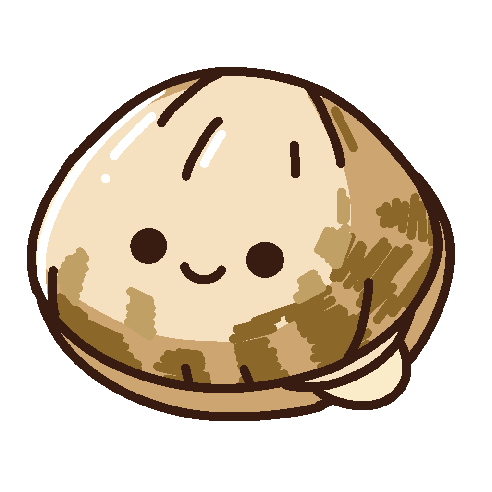
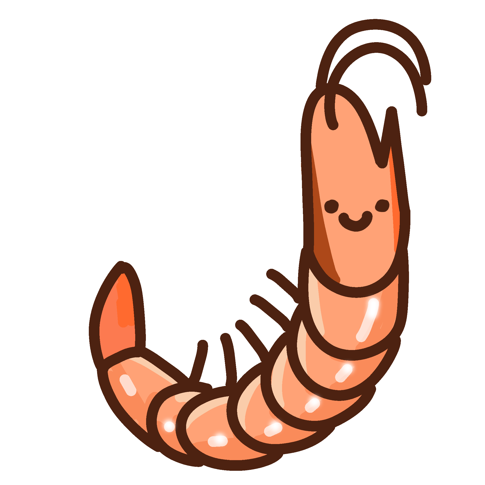
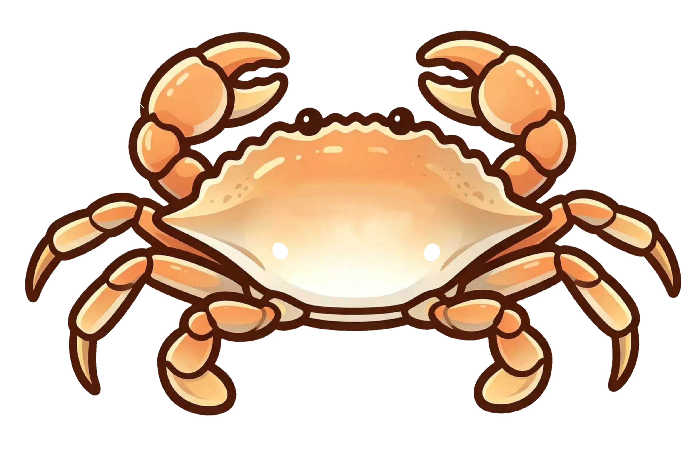

# 🧊 Block Puzzle — Seafood Market

A hybrid of **block puzzle** and **sim-management**. Place polyomino pieces on an 8×8 board, clear rows & columns, and serve seafood-loving customers to earn shells.

   

---

## 🎮 Play

Just open `index.html` in any browser — no build, no server, no dependencies.

**[Live on GitHub Pages →](https://你的用户名.github.io/block/)**

---

## 🕹 Game Modes

| Mode | Goal |
|------|------|
| **Free Play** | Classic block puzzle. Clear rows & columns, chase your high score! |
| **Market Mode** | Seafood market sim. Fill customer basket zones to serve orders and earn 🐚 shells. |

---

## 🐚 Market Mode

- Customers arrive with a **basket zone** highlighted on the board
- Fill every cell inside the basket to complete the order
- **Seafood pieces** appear on the board — immune to row/column clears, only removed when included in a basket serve
- Earn **shells** (base 5 + 3 per seafood cell in basket)
- Spend shells in the **Shop** to buy power-ups

---

## 💣 Power-ups

| Item | Effect | Cost |
|------|--------|------|
| 💣 Bomb | Destroy a 3×3 area on the board | 10 🐚 |
| 🔀 Shuffle | Replace all unplaced pieces | 8 🐚 |
| ↩️ Undo+ | Reverse your last placement | 5 🐚 |

---

## 🎨 Features

- 25+ polyomino piece shapes
- 19 hand-drawn seafood image assets
- Dark / Light theme
- Sound effects with mute toggle
- Combo scoring & particle effects
- Undo system
- Power-up shop
- All progress saved to `localStorage`

---

## 🛠 Tech Stack

| Layer | Tech |
|-------|------|
| Rendering | HTML5 Canvas |
| Logic | Vanilla JavaScript |
| Styling | CSS Custom Properties |
| Storage | `localStorage` |
| Images | PNG (transparent) |

---

## 📁 Project Structure

```
block/
├── index.html          # Main page & UI
├── game.js             # All game logic
├── assets/
│   └── seafood/        # 19 seafood PNG images
├── GAME_DESIGN.md      # Full design document
└── README.md
```

---

## 🚀 Deploy to GitHub Pages

1. Push this repo to GitHub
2. Settings → Pages → Source: `main` branch → Save
3. Your game is live at `https://<user>.github.io/block/`

---

*Made with vanilla JS & love for seafood 🦀*
